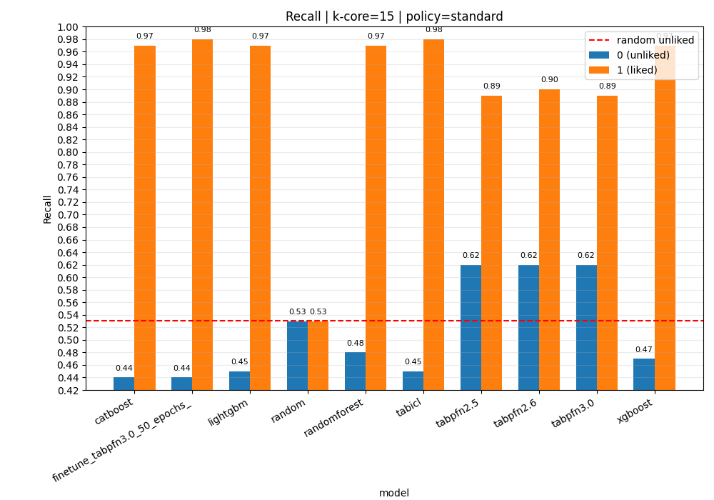
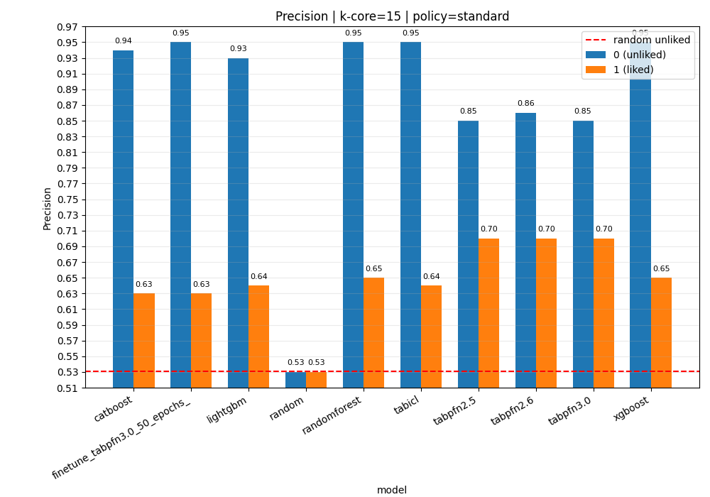
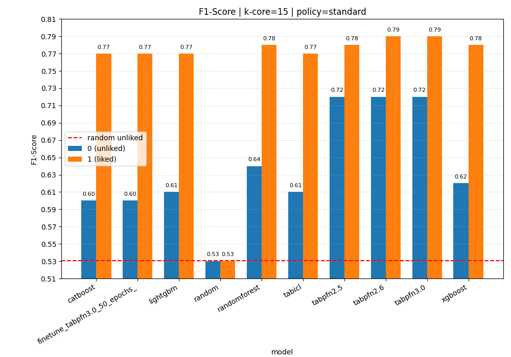

# Predicting Explicit Negative Feedback with Foundation Models for Tabular Data

Experimental study on using transformer-based foundation models to predict **explicit negative user feedback** in a short-video recommender setting.

## Objective

The main research question is:

> Does it make sense to use tabular foundation models (e.g., TabPFN, TabICL) to predict explicitly negative interactions (`hate`) compared to classical ML baselines?

The focus is not to maximize positive prediction (which is abundant), but to improve sensitivity on negative feedback, which is often more critical for user experience quality, especially in a conformal risk control setting where predictions can be used to reduce user exposure to potentially harmful content.

## Dataset

- Source: **KuaiRand-27K** (files in `KuaiRand-27K/`)
- Supported policies:
1. `standard` (default)
2. `random`

After preprocessing (example: `standard`, `k_core=15`), the processed dataset contains:

- Rows: `41,828`
- Unique users: `664`
- Unique videos: `9,359`
- Labels:
1. `1` = liked
2. `0` = unliked / hate

## Data Preparation (`data_processing.py`)

Applied pipeline:

1. Load logs based on policy (`standard` or `random`).
2. Keep only interactions with explicit signal: `is_like == 1` or `is_hate == 1`.
3. Build binary label:
- `label = 1` if `is_like == 1`
- `label = 0` if `is_hate == 1`
4. Keep only users with both classes (at least one positive and one negative interaction).
5. Apply **k-core on positive interactions only**:
- item k-core on positives (`video_id` with at least `k` positive interactions)
- user k-core on positives (`user_id` with at least `k` positive interactions)
6. Re-attach **all original negative interactions**.
7. Apply the “both classes per user” filter again after merging.
8. Drop unused columns (`profile_stay_time`, `is_rand`, `tab`).
9. Create `timestamp` from `time_ms` and save TSV in `processed_data/`.

Why this design: positive feedback is much more frequent and can dominate training. A high k-core on positives makes the dataset more informative (active users/items) while preserving the full negative signal.

## Split Strategy

The split is **grouped by user** and intentionally designed for the negative-feedback task.

For each user:

1. Separate positive and negative interactions.
2. Sample **1 positive + 1 negative** interaction for test.
3. Put all remaining interactions into train.

This guarantees:

- each user contributes both classes to the test set;
- test evaluation truly measures user-level positive/negative discrimination;
- no validation split is used in the current `run.py` flow (even though `ratios` is passed, the function returns only train/test).

## Models Compared (`run.py`)

### Foundation / transformer-based models for tabular data

1. `tabpfn2.5`
2. `tabpfn2.6`
3. `tabpfn3.0`
4. `tabicl`

### Classical baselines

1. `xgboost`
2. `lightgbm`
3. `randomforest`
4. `catboost`
5. `random` (`DummyClassifier`, uniform)

## Metrics and Reporting

Test metrics are saved for both classes (`0` unliked, `1` liked):

1. Precision
2. Recall
3. F1-score
4. Support

Output format: `results/{model}_{policy}_kcore_{k}_results.csv` (TSV).

`make_plots.py` aggregates all result files and generates PDF bar plots in `results/plots/` for class-wise precision/recall/F1.

## Results

The recall comparison across models is shown here:



The precision comparison across models is shown here:



The F1-score comparison across models is shown here:



In the current run, **TabPFN** achieves the best recall while requiring only a single forward pass at inference time (no per-dataset training updates), making it both accurate and fast to evaluate.

## Reproducibility

### 1) Preprocessing

```bash
python data_processing.py --policy standard --k_core 15
```

### 2) Training + multi-model evaluation

```bash
export CUDA_VISIBLE_DEVICES=0
python run.py --model random,tabicl,tabpfn2.5,tabpfn2.6,tabpfn3.0,xgboost,lightgbm,randomforest,catboost --policy standard --k_core 15
```

### 3) Result plots

```bash
python make_plots.py
```

### 4) TabPFN v3 fine-tuning (optional)

```bash
python run.py --model finetune_tabpfn3.0 --policy standard --k_core 15 --epochs 5 --learning_rate 2e-5
```

## Important Notes and Known Limitations

1. TabPFN/TabICL become difficult to use on very large datasets; the preprocessing design is partly motivated by this computational constraint.
2. The implemented split is user-grouped train/test with 1 positive + 1 negative per user in test; there is no separate validation split in the current flow, mainly due to the computational constraints of TabPFN and TabICL.
3. Additional user/video features exist in the repository but are currently not joined; evaluating expanded feature sets is too expensive under TabPFN compute constraints.
4. TabPFN 2.0 was not evaluated because it does not support more than 10k rows.

## Why This Setup Matches the Goal

This is not a generic click prediction task. It targets **explicit dislike/hate prediction**. The pipeline enforces per-user evaluation on both classes and preserves negative signals during dataset construction. This makes the comparison between tabular foundation models and traditional baselines more faithful to the product objective.

## Generative AI Disclosure

Codex/Claude was used to draft `make_plots.py` and this README.

## References

- Dataset: https://kuairand.com
- TabPFN fine-tuning docs: https://docs.priorlabs.ai/capabilities/fine-tuning
- TabICL repository: https://github.com/soda-inria/tabicl
- TabPFN classifier API: https://github.com/PriorLabs/TabPFN/blob/main/src/tabpfn/classifier.py
- TabPFN versions and basic usage: https://github.com/PriorLabs/TabPFN
- TabPFN tuning example: https://github.com/PriorLabs/TabPFN/blob/main/examples/tabpfn_with_tuning.py
- TabPFN metric tuning docs: https://docs.priorlabs.ai/capabilities/metric-tuning